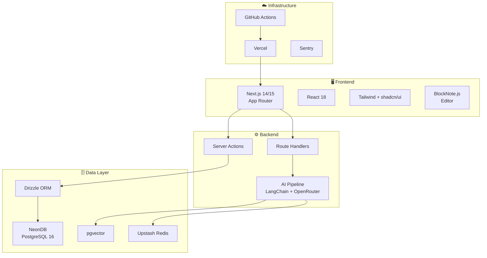
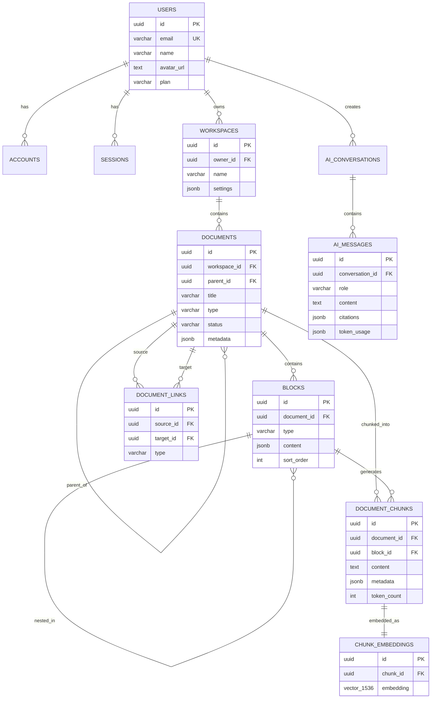
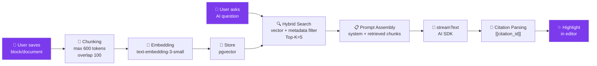
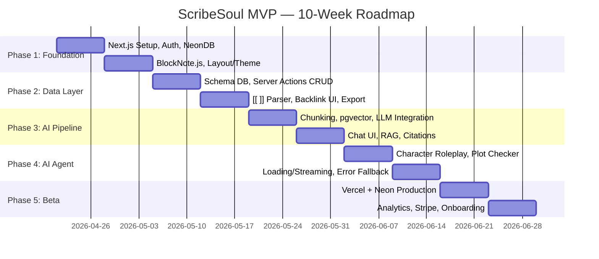

# 🔍 Phân Tích Chi Tiết Dự Án ScribeSoul

## 1. Tổng Quan Dự Án

**ScribeSoul** là một nền tảng viết sáng tạo (creative writing platform) tích hợp AI, được thiết kế đặc biệt dành cho **nhà văn, tiểu thuyết gia, và những người sáng tạo nội dung văn học**. Sản phẩm kết hợp giữa:

- **Editor block-based kiểu Notion** để viết và tổ chức nội dung
- **Hệ thống liên kết hai chiều (bi-directional linking)** như Obsidian
- **AI RAG (Retrieval-Augmented Generation)** hiểu ngữ cảnh nhân vật, cốt truyện, bối cảnh

> [!IMPORTANT]
> **Điểm khác biệt cốt lõi**: ScribeSoul không phải là một trình soạn thảo với AI bổ sung. Nó là một **"Curator thông minh"** — AI hiểu toàn bộ thế giới quan của tác phẩm, có thể phát hiện lỗ hổng cốt truyện, phân tích động lực nhân vật, và gợi ý sáng tạo dựa trên toàn bộ tri thức đã viết.

### Thông số dự án

| Thuộc tính | Giá trị |
|---|---|
| **Team size** | 1-3 developers |
| **Timeline MVP** | 10 tuần |
| **Ngân sách cloud** | < $80/tháng |
| **Target AI cost** | < $0.02/session |
| **Beta target** | 50 testers, NPS > 40 |

---

## 2. Kiến Trúc Kỹ Thuật

### 2.1. Tech Stack



### 2.2. Kiến trúc luồng dữ liệu

```
[Client] Next.js App Router (Server/Client Components)
    ↓ (Server Actions / API Routes)
[Next.js Server] Edge Runtime (middleware) + Node.js (AI/DB heavy)
    ↓ (Drizzle ORM + pg)
[NeonDB] PostgreSQL + pgvector + RLS policies
    ↓ (Vector search + AI prompts)
[AI Layer] LLM API → Prompt Router → RAG Retriever → Streaming Response
    ↓ (Cache)
[Upstash Redis] Rate limit, AI response cache, session lock
```

### 2.3. Cấu trúc thư mục dự kiến

```
src/
├─ app/
│  ├─ (auth)/login, register, callback/
│  ├─ (workspace)/[workspaceId]/
│  │  ├─ documents/[docId]/page.tsx    ← Core Editor
│  │  ├─ chat/page.tsx                  ← AI Brainstorm
│  │  └─ settings/page.tsx
│  ├─ api/
│  │  ├─ chat/route.ts                  ← Streaming AI
│  │  ├─ sync/route.ts                  ← Block save, conflict resolution
│  │  └─ ingest/route.ts               ← Chunk & embed pipeline
│  └─ layout.tsx, page.tsx
├─ components/
│  ├─ editor/BlockEditor.tsx            ← BlockNote wrapper
│  ├─ ai/ChatInterface.tsx
│  └─ ui/ (shadcn)
├─ lib/
│  ├─ db/ (drizzle schema, queries)
│  ├─ ai/ (rag.ts, prompts.ts, cache.ts)
│  ├─ auth/ (auth.config.ts, adapter.ts)
│  └─ utils/
├─ server/
│  ├─ actions/ (saveBlocks, createLink, askAI)
│  └─ middleware/ (auth, rateLimit, cors)
└─ styles/
```

> [!NOTE]
> Dự án sử dụng kiến trúc **Server Components + Client Islands** của Next.js App Router, kết hợp Server Actions cho mutations và Route Handlers cho streaming AI — đây là pattern hiện đại và phù hợp cho ứng dụng này.

---

## 3. Hệ Thống Thiết Kế

ScribeSoul có **hai hệ thống thiết kế hoàn chỉnh**, mỗi cái mang một triết lý riêng biệt:

### 3.1. Light Mode — "The Silent Manuscript" (The Digital Curator)

Triết lý: *Trang giấy trống trên bàn gỗ sồi — tối giản, tĩnh lặng, mời gọi sáng tạo.*

| Token | Giá trị | Vai trò |
|---|---|---|
| Surface | `#fbf9f4` | Nền "bàn làm việc" |
| Surface-Container-Low | `#f5f3ee` | Sidebar, navigation |
| Surface-Container-Lowest | `#ffffff` | Vùng editor chính |
| Surface-Container-High | `#eae8e3` | Panels phụ |
| Primary | `#4f4e4e` | Buttons, text chính |
| Secondary | `#712ae2` → `#8a4cfc` | AI features, CTAs |

**Nguyên tắc cốt lõi:**
- ❌ **No-Line Rule**: Cấm dùng `1px solid border` để chia section — phải dùng tonal shift
- ✅ **Glassmorphism**: Menu floating dùng `backdrop-blur(12px)` + opacity 60%
- ✅ **Serif for creation, Sans-serif for operation**: Font Newsreader cho nội dung viết, Inter cho UI

````carousel

<!-- slide -->

<!-- slide -->

<!-- slide -->

````

### 3.2. Dark Mode — "Deep Space Editorial" (The Midnight Archivist)

Triết lý: *Thư viện riêng lúc hoàng hôn — yên tĩnh, uy tín, tập trung sâu. Không gian vũ trụ indigo.*

| Token | Giá trị | Vai trò |
|---|---|---|
| Surface | `#0b1326` | Nền "cosmic floor" |
| Surface-Container-Low | `#131b2e` | Sidebar |
| Surface-Container | `#171f33` | Card, content container |
| Surface-Container-Highest | `#2d3449` | Floating modals |
| Primary Accent | `#d2bbff` | Text nổi bật, links |
| Primary Container | `#7c3aed` | Brand moments, active states |

**Nguyên tắc cốt lõi:**
- ❌ Cấm dùng Pure Black (`#000000`) — phải dùng "Deep Space" indigo
- ❌ Cấm Pure White (`#FFFFFF`) — dùng `#E2E8F0` off-white
- ✅ Elevation qua luminosity, không dùng drop shadow
- ✅ **"Frosted Obsidian"** glassmorphism cho floating nav
- ✅ **"Archivist Scroll"**: Thanh progress dọc margin bằng `1px primary` line

````carousel

<!-- slide -->

<!-- slide -->

<!-- slide -->

````

### 3.3. So sánh hai hệ thống thiết kế

| Tiêu chí | Light "Silent Manuscript" | Dark "Deep Space" |
|---|---|---|
| **Cảm xúc** | Ấm áp, tĩnh lặng, cổ điển | Huyền bí, vũ trụ, futuristic |
| **Đối tượng** | Nhà văn truyền thống, non-fiction | Sci-fi/Fantasy writers, Gen Z |
| **Font chủ đạo** | Newsreader (Serif) | Newsreader (Serif) |
| **AI persona** | "Soul Assistant" | "Celestial Intelligence" / "ScribeSoul" |
| **Signature element** | Warm Paper tones | Violet Glow + Frosted Obsidian |
| **Strengths** | Dễ đọc lâu, chuyên nghiệp | Immersive, wow-factor cao |

---

## 4. Database Schema

### 4.1. Entity Relationship Diagram



### 4.2. Các bảng chính (6 nhóm)

| Nhóm | Bảng | Mục đích |
|---|---|---|
| **Auth** | `users`, `accounts`, `sessions` | Auth.js v5 + DrizzleAdapter, OAuth + Magic Link |
| **Workspace** | `workspaces`, `documents` | Tổ chức nội dung theo workspace, cây thư mục |
| **Content** | `blocks` | Block-based content (JSONB), Notion-like |
| **Linking** | `document_links` | Bi-directional links (`[[...]]`), 4 loại link |
| **AI/Vector** | `document_chunks`, `chunk_embeddings` | RAG pipeline, pgvector 1536 chiều, HNSW index |
| **Conversations** | `ai_conversations`, `ai_messages` | Chat history, citations, token tracking |

### 4.3. Quyết định thiết kế đáng chú ý

- **UUID v7** cho PKs — tối ưu index + phân tán
- **JSONB** cho block content — linh hoạt với BlockNote JSON structure
- **RLS trên mọi bảng** — security at database level, không phụ thuộc application logic
- **HNSW Index** cho vector search — nhanh hơn IVFFlat cho dataset nhỏ-vừa (phù hợp MVP)
- **CASCADE deletes** — tự động dọn dẹp, tránh orphan data

> [!TIP]
> Schema được thiết kế khá tốt cho MVP. Tuy nhiên, bảng `blocks` lưu từng block riêng lẻ có thể gây nhiều query. Nếu performance là concern, cân nhắc lưu toàn bộ document content dưới dạng 1 JSONB column trong `documents` và chỉ tách blocks khi cần sync conflict resolution.

---

## 5. AI Pipeline (RAG)

### 5.1. Luồng xử lý



### 5.2. Các tính năng AI chính

| Tính năng | Mô tả | Độ phức tạp |
|---|---|---|
| **Inline AI Generator** | Bôi đen text → Menu AI → Stream kết quả trực tiếp | Trung bình |
| **Background Extraction** | Tự động nhận diện thực thể (Nhân vật, Địa điểm) → tạo link nét đứt | Cao |
| **Character Roleplay** | Chat với AI trong vai nhân vật dựa trên dữ liệu đã viết | Cao |
| **Plot Checker** | Phát hiện mâu thuẫn timeline, logic trong cốt truyện | Rất cao |
| **Conflict Detection** | So sánh cross-reference giữa các chương để phát hiện inconsistency | Rất cao |
| **Prose Style Analysis** | Phân tích phong cách văn, nhịp điệu, tone | Trung bình |

### 5.3. Chiến lược Fallback & Chi phí

- **Model chính**: GPT-4o / Claude via OpenRouter
- **Fallback**: Nếu API timeout → chuyển model nhỏ hơn hoặc cached response
- **Cache**: Upstash Redis cho AI responses đã dùng
- **Target**: < $0.015/session → cần chunking chặt chẽ và context window management

---

## 6. Lộ Trình Phát Triển (10 Tuần)



### Tiêu chí hoàn thành theo phase

| Phase | Tuần | Deliverable chính | Acceptance Criteria |
|---|---|---|---|
| **Foundation** | 1-2 | Setup Next.js, Auth, Editor | Đăng nhập được, tạo workspace, editor render JSON |
| **Data Layer** | 3-4 | CRUD, Linking, Export | Link hai chiều hoạt động, export/import `.md` chuẩn |
| **AI Pipeline** | 5-6 | RAG, Chat UI | AI trả lời đúng ngữ cảnh, citation, latency < 3s |
| **AI Agent** | 7-8 | Roleplay, Plot Check | Chat nhân vật ổn định, retention D7 > 25%, 0 critical bugs |
| **Beta** | 9-10 | Production deploy | 50 beta testers, AI cost < $0.02/session, NPS > 40 |

---

## 7. Đánh Giá Rủi Ro

| Rủi ro | Xác suất | Tác động | Giải pháp |
|---|---|---|---|
| 🔴 **AI hallucination** | Cao | Trung bình | Strict RAG, citation bắt buộc, chế độ "Human Review" |
| 🟡 **Chi phí token bùng nổ** | Trung bình | Cao | Cache Redis, model rẻ cho draft, giới hạn context |
| 🟢 **Data sync conflict** | Thấp | Cao | Optimistic UI + queue retry, lock version khi AI edit |
| 🔴 **Scope creep** | Cao | Cao | Strict PRD, kill tính năng không dùng sau 2 tuần beta |

---

## 8. Phân Tích SWOT

### Strengths (Điểm mạnh)
- 🎯 **Niche rõ ràng**: Tập trung vào creative writers — thị trường chưa bão hòa
- 🎨 **Design system premium**: Hai theme hoàn chỉnh với triết lý sâu sắc, không phải "generic SaaS"
- 🏗️ **Tech stack hiện đại**: Next.js App Router + Server Actions + pgvector — cutting-edge nhưng stable
- 🔐 **Security-first**: RLS database level, không chỉ application level
- 📋 **Documentation tốt**: PRD, Tech Spec, DB Schema đều có sẵn trước khi code

### Weaknesses (Điểm yếu)
- ⚠️ **Team size nhỏ (1-3 dev)** cho scope khá lớn
- ⚠️ **10 tuần aggressive** cho MVP với AI pipeline phức tạp
- ⚠️ **Chưa có source code** — dự án đang ở giai đoạn documentation/design
- ⚠️ **Phụ thuộc nhiều dịch vụ bên thứ ba**: OpenRouter, Neon, Vercel, Upstash

### Opportunities (Cơ hội)
- 📈 **Thị trường AI writing tools** đang tăng mạnh nhưng ít sản phẩm chuyên cho fiction/creative writing
- 🌍 **Mô hình RAG cho creative writing** là unique selling proposition mạnh
- 💰 **SaaS model**: Free → Pro → Team tạo revenue path rõ ràng

### Threats (Nguy cơ)
- ⚡ **Notion AI, Google Docs AI** có thể thêm features tương tự
- 💸 **Chi phí AI API** không ổn định, có thể tăng
- 🧩 **Complexity của real-time collaboration** nếu scale lên team plan

---

## 9. Đề Xuất Cải Tiến

### 9.1. Ưu tiên cao (nên làm trước khi code)

> [!WARNING]
> **Chưa có source code nào được viết.** Dự án hiện chỉ có documentation (.doc) và design mockups (.design). Cần khởi tạo codebase ngay.

1. **Khởi tạo Next.js project** với đầy đủ config (ESLint, TypeScript strict, Tailwind, shadcn/ui)
2. **Setup Drizzle schema** từ SQL specification đã có
3. **Implement design tokens** dưới dạng CSS custom properties — cả Light lẫn Dark mode
4. **Auth flow** với Auth.js v5 + DrizzleAdapter

### 9.2. Ưu tiên trung bình (Phase 2-3)

5. **Document state management**: Cân nhắc lưu full document JSONB trong `documents` table thay vì tách từng block — giảm round-trips
6. **Offline-first**: Thêm Service Worker + IndexedDB để editor hoạt động offline, sync sau
7. **AI Prompt versioning**: Lưu prompt templates trong DB hoặc file, dễ iterate

### 9.3. Ưu tiên thấp (Post-MVP)

8. **Real-time collaboration**: WebSocket / Supabase Realtime (đã note trong spec)
9. **Mobile responsive**: Mockup hiện tại chỉ có desktop
10. **Multi-language AI**: Hỗ trợ viết bằng nhiều ngôn ngữ

---

## 10. Tổng Kết

| Khía cạnh | Đánh giá | Ghi chú |
|---|---|---|
| **Ý tưởng sản phẩm** | ⭐⭐⭐⭐⭐ | Niche rõ, USP mạnh, giải quyết pain point thực |
| **Documentation** | ⭐⭐⭐⭐ | 3 docs + PRD đủ chi tiết, cần thêm API spec |
| **Design System** | ⭐⭐⭐⭐⭐ | Hai theme premium, triết lý sâu, mockup đẹp |
| **Tech Architecture** | ⭐⭐⭐⭐ | Modern stack, hợp lý, cần validate performance |
| **Database Design** | ⭐⭐⭐⭐ | Solid schema, RLS tốt, cần stress test vector search |
| **AI Pipeline** | ⭐⭐⭐⭐ | RAG design rõ ràng, cần prototype sớm để validate accuracy |
| **Feasibility (10 tuần)** | ⭐⭐⭐ | Aggressive nhưng khả thi nếu strict scope + 2-3 developers |
| **Code Implementation** | ⭐ | **Chưa có source code — cần bắt đầu ngay** |

> [!IMPORTANT]
> **Kết luận**: ScribeSoul là một dự án có tầm nhìn xuất sắc và documentation/design chuẩn bị kỹ lưỡng. Điểm yếu duy nhất là **chưa có code nào được viết**. Bước tiếp theo hợp lý nhất là **khởi tạo Next.js project và bắt đầu Phase 1 (Foundation & UI Core)** ngay lập tức.
